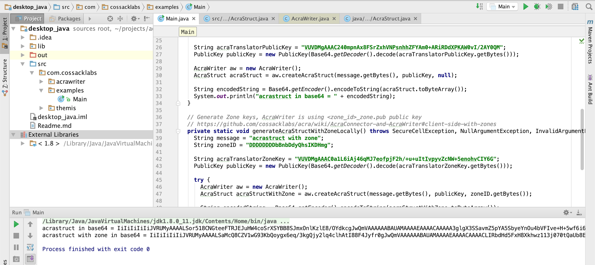

This example is fairly simple: java code that generates AcraStructs locally.

# Building and running

Please run project from Acra repository. 

1. [Install Themis core library to your system](https://docs.cossacklabs.com/pages/documentation-themis/#installing-themis-core).

2. Run `Main.java`.




## Dependencies

This example depends on `acrawriter` and `themis` libraries, which currently should be installed manually. 

Themis installation consists of:

1. [Installing Themis core library](https://docs.cossacklabs.com/pages/documentation-themis/#installing-themis-core) as system library.
2. [Building `libthemis_jni` library](https://docs.cossacklabs.com/pages/java-and-android-howto/#install-on-desktop-java), and adding it as dependency to project. After building, take `libthemis_jni` library and put into `java-desktop_java/lib` folder. Link library to the project (if you use IDEA: `File > Project structure > Lbraries > lib > Java > lib/libthemis_jni`).
3. Adding latest Themis Java code to your project from ([themis/src/wrappers/themis/java](https://github.com/cossacklabs/themis/tree/master/src/wrappers/themis/java/com/cossacklabs/themis)). Paste into `desktop_java/src` folder.

AcraWriter installation consists of:

1. Adding latest AcraWriter Java code to your project from ([acra/wrappers/java](https://github.com/cossacklabs/acra/tree/master/wrappers/java)). Paste into `desktop_java/src` folder.

If you need just to run the project, [install Themis core library](https://docs.cossacklabs.com/pages/documentation-themis/#installing-themis-core) to your system. If you need to update dependent libraries to newest versions, follow steps above.


# Generating AcraStruct without zone

Please update AcraStrorage Public key to yours:

```java
import com.cossacklabs.themis.*;
import com.cossacklabs.acrawriter.*;

String message = "secret message";
String acraTranslatorPublicKey = "VUVDMgAAAC240mpnAx8FSrZxhVNPsnhhZFYAm0+ARiRDdXPKAW0vI/2AY0QM";
PublicKey publicKey = new PublicKey(Base64.getDecoder().decode(acraTranslatorPublicKey.getBytes()));

AcraWriter aw = new AcraWriter();
AcraStruct acraStruct = aw.createAcraStruct(message.getBytes(), publicKey, null);

String encodedString = Base64.getEncoder().encodeToString(acraStruct.toByteArray());
System.out.println("acrastruct in base64 = " + encodedString);
```


# Generating AcraStruct with zone

Please update AcraStrorage Zone Public key to yours:

```java
import com.cossacklabs.themis.*;
import com.cossacklabs.acrawriter.*;

String message = "acrastruct with zone";
String zoneID = "DDDDDDDDbBnbDdyQhsIKDHmg";

String acraTranslatorZoneKey = "VUVDMgAAAC0a1L6iAj46qMJ7eofpjF2h/+u+uItIvpyvZcNW+5enohvCIY6G";
PublicKey publicKey = new PublicKey(Base64.decode(acraTranslatorZoneKey.getBytes(), Base64.NO_WRAP));

AcraWriter aw = new AcraWriter();
AcraStruct acraStructWithZone = aw.createAcraStruct(message.getBytes(), publicKey, zoneID.getBytes());

String encodedString = Base64.getEncoder().encodeToString(acraStructWithZone.toByteArray());
System.out.println("acrastruct with zone in base64 = " + encodedString);
```
